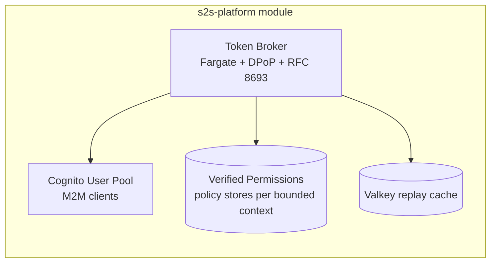
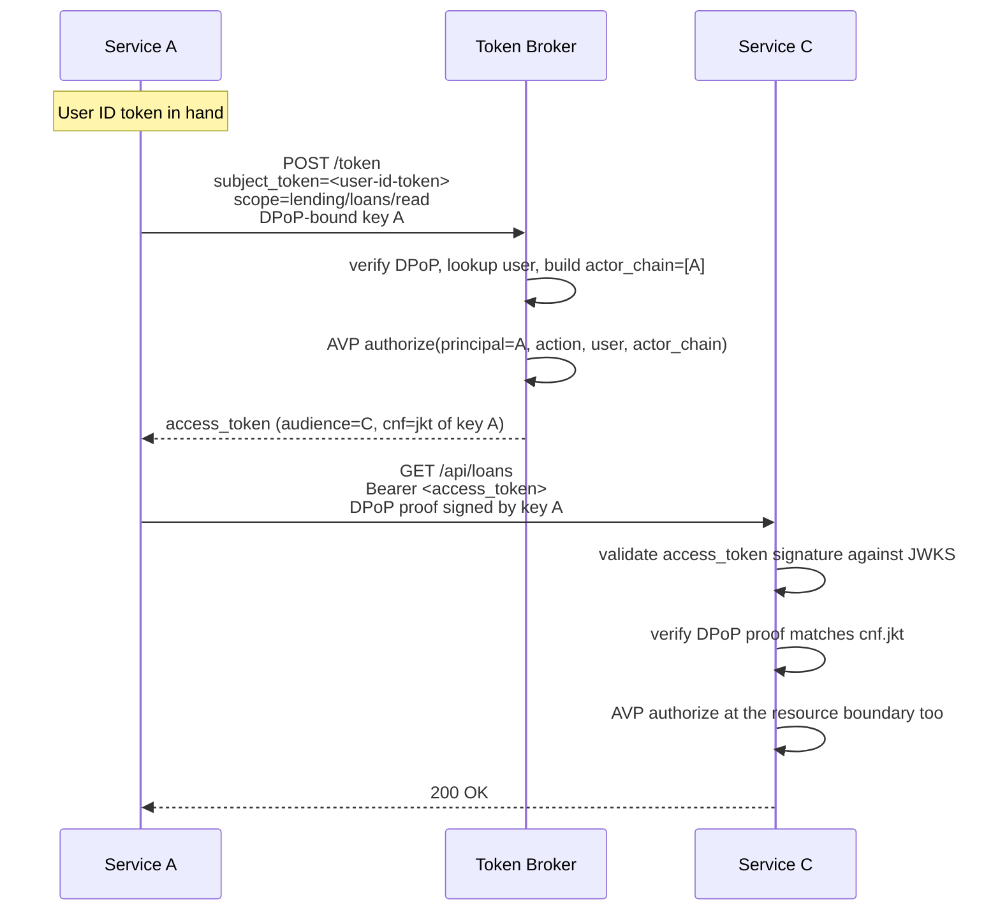

# Architecture

How the S2S Identity Stack works at a high level. Pair with the spec at
`docs/superpowers/specs/2026-05-20-platform-modularization-design.md` for the
authoritative design.

## Identity plane

## Token exchange (RFC 8693 + DPoP)

If Service C in turn calls Service D, it repeats the exchange — pushing
`subject_token=<A->C token>` to the broker. The broker appends C to the
actor_chain so policies authoring at D see `actor_chain = [C, A]`.

## DPoP binding

Each service holds an ES256 keypair (`initKeyPair()` in `@s2s/auth-library`).
The public key's JWK thumbprint is bound into every access token's `cnf.jkt`
claim. Every outbound HTTP call sends a DPoP proof signed by the private key.
A stolen token cannot be replayed by another service — it would lack the
private key to sign a valid proof.

The broker stores recent DPoP `jti` values in Valkey to detect replay within
the proof's 60-second freshness window.

## AVP + Cedar

Each **bounded context** gets its own AVP policy store. Policies are written
in Cedar (see [cedar-authoring.md](./cedar-authoring.md)). The broker calls
`IsAuthorized` on every exchange request; the response service can ALSO call
`IsAuthorized` at its resource boundary for defense-in-depth.

## Chained S2S + user context propagation

The `user` and `actor_chain` context fields make per-user authorization
decisions possible at every hop of a multi-service call, without requiring
the end user's bearer token to traverse the whole chain.

## Hardening

The s2s-service module enforces the secure task shape with no override
inputs. Two further layers ratchet down bypass risk (planned, not v2.0.0):

- **v2.1 — AWS Config Rule** detects task definitions tagged
  `s2s-managed=true` that lack mandatory sidecars.
- **v2.x — SCP** denies `ecs:RegisterTaskDefinition` from any principal not
  tagged `TerraformModule=s2s-service` or `TerraformModule=s2s-platform`.

See spec §9.6 for both.

## What v2 does not do

(See also spec §12.)

- No web UI for registration / monitoring / policy management
- No multi-cloud
- No native Kubernetes path (Fargate-only)
- No private Terraform Registry (consumers pin via git tag)
- No service-to-service mTLS (DPoP supersedes it)
