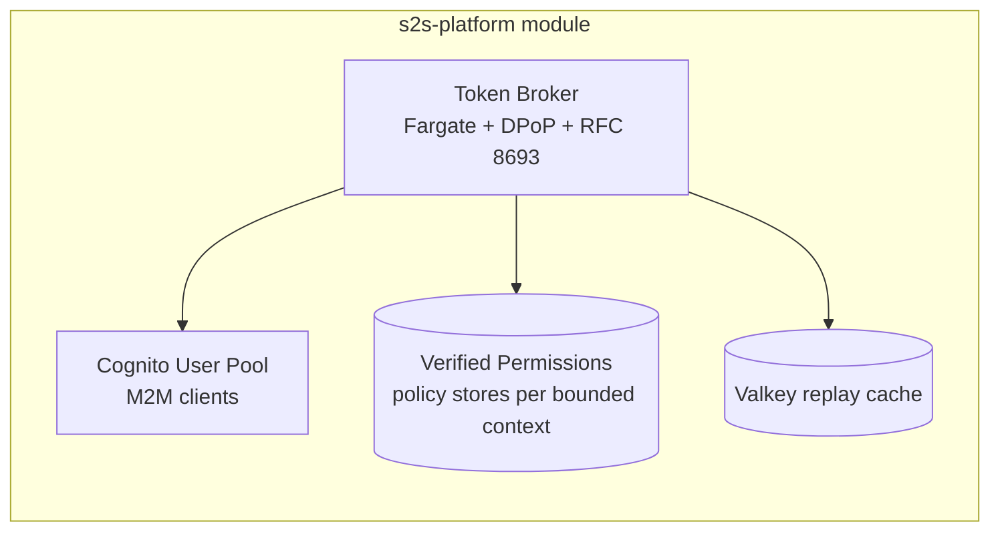

# Architecture

How the S2S Identity Stack works at a high level. Pair with the spec at
`docs/superpowers/specs/2026-05-20-platform-modularization-design.md` for the
authoritative design.

## Identity plane



## Token exchange (RFC 8693 + DPoP)

```mermaid
sequenceDiagram
  participant A as Service A
  participant B as Token Broker
  participant C as Service C
  Note over A: User ID token in hand
  A->>B: POST /token<br/>subject_token=&lt;user-id-token&gt;<br/>scope=lending/loans/read<br/>DPoP-bound key A
  B->>B: verify DPoP, lookup user, build actor_chain=[A]
  B->>B: AVP authorize(principal=A, action, user, actor_chain)
  B-->>A: access_token (audience=C, cnf=jkt of key A)
  A->>C: GET /api/loans<br/>Bearer &lt;access_token&gt;<br/>DPoP proof signed by key A
  C->>C: validate access_token signature against JWKS
  C->>C: verify DPoP proof matches cnf.jkt
  C->>C: AVP authorize at the resource boundary too
  C-->>A: 200 OK
```

If Service C in turn calls Service D, it repeats the exchange — pushing
`subject_token=<A->C token>` to the broker. The broker appends C to the
actor_chain so policies authoring at D see `actor_chain = [C, A]`.

## DPoP binding

Each service holds an ES256 keypair (`initKeyPair()` in `@s2s/auth-library`).
The public key's JWK thumbprint is bound into every access token's `cnf.jkt`
claim. Every outbound HTTP call sends a DPoP proof signed by the private key.
A stolen token cannot be replayed by another service — it would lack the
private key to sign a valid proof. As of v2.2.0 this is enforced at issuance,
not just per request: the token carries `cnf.jkt` bound to the holder's key
(see [DPoP sender-constraint](#dpop-sender-constraint-cnfjkt) below), so a
leaked broker-issued token is useless without the bound DPoP private key.

The broker stores recent DPoP `jti` values in Valkey to detect replay within
the proof's 60-second freshness window.

### DPoP sender-constraint (`cnf.jkt`)

As of **v2.2.0** the stack implements a **true issuance-time sender-constraint**
per RFC 9449 §5–6, not just proof-of-possession on each request.

**Proof-of-possession-per-request (what we had):** every outbound call carried a
fresh DPoP proof, and receivers verified that proof's signature, `htm`, `htu`,
`iat`, and replay `jti`. But the broker-issued **token itself** was not bound to
any key at issuance. The token advertised `token_type: DPoP`, yet nothing tied a
given token to a specific holder keypair — a leaked token could in principle be
paired with the thief's own freshly-minted (self-consistent) proof.

**Issuance-time sender-constraint (what `cnf.jkt` adds):** the holder now
**presents its key at exchange time**. The caller signs a DPoP proof over the
token request (`htm=POST`, `htu=`broker token endpoint, **no** `ath` — there is
no access token yet), and the broker mints the new token with a confirmation
claim `cnf: { jkt }` equal to the JWK thumbprint of **that** proof's key. The
token is now cryptographically welded to one keypair at the moment it is issued.

**Receiver comparison:** at the resource boundary the receiver computes the
thumbprint of the request's DPoP-proof key and requires it to equal the token's
`cnf.jkt`. Token without `cnf.jkt`, or proof key not equal to `cnf.jkt`, is a
hard `401` (`dpop_key_mismatch`). This enforcement is on by default
(`requireCnfBinding` defaults true) and only applies when DPoP is enabled
(`requireDPoP`).

**Chain re-binding:** in a multi-hop chain each service presents **its own** key.
When service C exchanges the A->C token for a C->D token, C signs the exchange
proof with C's key, and the broker re-binds the new token's `cnf.jkt` to C's
thumbprint. Each hop's token is bound to that hop's holder; no key is shared
down the chain. The end-user leg stays a plain **bearer** ID token (the user is
not a DPoP holder) — only the service-to-service tokens carry `cnf.jkt`.

```mermaid
sequenceDiagram
  participant CALL as calling-service
  participant BRK as Token Broker
  participant RECV as receiving-service
  participant LED as ledger-service
  Note over CALL: holds key A
  CALL->>BRK: POST /oauth2/token (exchange)<br/>DPoP proof signed by key A (no ath)
  BRK->>BRK: verify proof; jkt = thumbprint(key A)
  BRK-->>CALL: token-1 with cnf.jkt = jkt(A)
  CALL->>RECV: request + token-1 + DPoP proof (key A)
  RECV->>RECV: thumbprint(proof key) == token-1.cnf.jkt ? bind OK : 401
  Note over RECV: holds key C
  RECV->>BRK: POST /oauth2/token (re-exchange token-1)<br/>DPoP proof signed by key C (no ath)
  BRK->>BRK: verify proof; re-bind jkt = thumbprint(key C)
  BRK-->>RECV: token-2 with cnf.jkt = jkt(C)
  RECV->>LED: request + token-2 + DPoP proof (key C)
  LED->>LED: thumbprint(proof key) == token-2.cnf.jkt ? bind OK : 401
```

**Precedence:** when the receiver also needs a fresh DPoP nonce, the nonce
challenge fires **first** (so the client can retry with the nonce); the
`cnf.jkt` mismatch is a separate, later **hard** failure with no retry.

**Header model recap (with `cnf.jkt`):**

| Header | Carries | Notes |
|--------|---------|-------|
| `Authorization` | SigV4 signature (Lattice mode) | network-layer IAM auth |
| `X-DPoP-Token` | broker-issued access token | now carries `cnf: { jkt }` |
| `DPoP` | DPoP proof JWT | its key's thumbprint must equal the token's `cnf.jkt` |

On the ALB (non-Lattice) path the access token rides `Authorization: DPoP …`
instead of `X-DPoP-Token`, but the `cnf.jkt` binding is identical.

## AVP + Cedar

Each **bounded context** gets its own AVP policy store. Policies are written
in Cedar (see [cedar-authoring.md](./cedar-authoring.md)). The broker calls
`IsAuthorized` on every exchange request; the response service can ALSO call
`IsAuthorized` at its resource boundary for defense-in-depth.

## Chained S2S + user context propagation

The `user` and `actor_chain` context fields make per-user authorization
decisions possible at every hop of a multi-service call, without requiring
the end user's bearer token to traverse the whole chain.

## VPC Lattice service-to-service (opt-in)

Since v2.1.0 the service-to-service network hop can run over **AWS VPC Lattice**
with **SigV4 IAM** authentication instead of the ALB. This is gated by
`enable_lattice` (platform + per-service input, **default `false`**). When off,
behavior is byte-for-byte identical to v2.0.x — everything below is inert.

### Control plane vs. data plane

The key design constraint: SigV4 signs the HTTP `Authorization` header, and the
broker's token-exchange call authenticates the actor with `client_secret_basic`
which **also** lives on `Authorization`. The two cannot share one request. So
the transport is split:

| Plane | Hop | Transport | Auth on `Authorization` |
|-------|-----|-----------|--------------------------|
| **Control plane** | service → **broker** token-exchange (RFC 8693) | **ALB** (`BROKER_TOKEN_ENDPOINT`) | `client_secret_basic` (`Basic …`) |
| **Data plane** | service → service (calling→receiving, receiving→ledger) | **VPC Lattice + SigV4** | SigV4 (`AWS4-HMAC-SHA256 …`) |

The broker exchange stays on the ALB with `client_secret_basic` in **both**
Lattice and non-Lattice modes. Only the service→service data-plane hops move onto
Lattice when `USE_LATTICE=true`.

### Header model (data plane, Lattice mode)

Because SigV4 owns `Authorization`, the DPoP-bound access token is relocated:

| Header | Carries | Notes |
|--------|---------|-------|
| `Authorization` | SigV4 signature | network-layer IAM auth (`vpc-lattice-svcs:Invoke`) |
| `X-DPoP-Token` | DPoP-bound access token | the broker-issued token (was `Authorization: DPoP …` on the ALB path) |
| `DPoP` | DPoP proof JWT | `htu` binds to the **Lattice DNS** URL of the callee |

The receiving middleware reads the access token from `X-DPoP-Token` first and
falls back to `Authorization: DPoP …`, so it accepts both transports.

### Request flow under Lattice

```mermaid
sequenceDiagram
  participant A as calling-service
  participant ALB as Broker ALB
  participant B as Token Broker
  participant L as VPC Lattice service network
  participant C as receiving-service
  Note over A: control plane — stays on ALB
  A->>ALB: POST /oauth2/token (RFC 8693)<br/>Authorization: Basic &lt;actor client_secret_basic&gt;<br/>DPoP proof (htu = broker ALB)
  ALB->>B: forward
  B-->>A: access_token (audience=receiving, cnf=jkt)
  Note over A,C: data plane — over Lattice + SigV4
  A->>L: POST /api/...<br/>Authorization: SigV4 (vpc-lattice-svcs:Invoke)<br/>X-DPoP-Token: &lt;access_token&gt;<br/>DPoP proof (htu = receiving Lattice DNS)
  L->>C: deliver (IAM auth-policy enforced)
  C->>C: read X-DPoP-Token; verify DPoP vs cnf.jkt; AVP authorize
  C-->>A: 200 OK
```

If receiving-service then calls ledger-service it repeats the same pattern: a
control-plane exchange on the broker ALB, then a data-plane SigV4 hop to the
ledger Lattice DNS.

### Enabling

See [deploying-the-stack.md](./deploying-the-stack.md#enabling-vpc-lattice).
Callers discover callees' published Lattice DNS via SSM, so the apply order is
**ledger → receiving → calling**. The task role needs `vpc-lattice-svcs:Invoke`
(granted by the s2s-service module when registered).

## Hardening

The s2s-service module enforces the secure task shape with no override
inputs. Two further layers ratchet down bypass risk (planned, not v2.0.0):

- **v2.1 — AWS Config Rule** detects task definitions tagged
  `s2s-managed=true` that lack mandatory sidecars.
- **v2.x — SCP** denies `ecs:RegisterTaskDefinition` from any principal not
  tagged `TerraformModule=s2s-service` or `TerraformModule=s2s-platform`.

See spec §9.6 for both.

## What v2 does not do

(See also spec §12.)

- No web UI for registration / monitoring / policy management
- No multi-cloud
- No native Kubernetes path (Fargate-only)
- No private Terraform Registry (consumers pin via git tag)
- No service-to-service mTLS (DPoP supersedes it)
